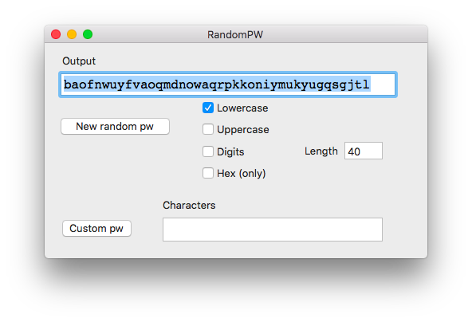

This repository contains a simple app written in Swift4 using Xcode.  

#### RandomPW

RandomPW uses a cryptographically secure source of random bytes 

```
SecRandomCopyBytes
```

to generate a password from a collection of characters which by default is the lowercase letters but may also include digits and uppercase letters.



